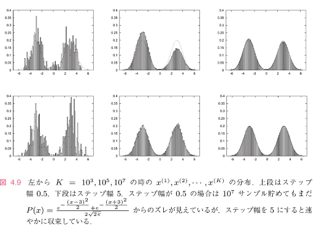

<!--
headingDivider: 1
-->

# 4.4.ガウス分布以外の例

ここまでは、

$$
S(x) = \frac{x^2}{2}
$$

$$
P(x) = \frac{e^{-S(x)}}{Z} = \frac{e^{-\frac{x^2}{2}}}{\sqrt{2\pi}}
$$

の例を見てきました。

---

二つのガウス分布を重ね合わせた

$$
P(x) = \frac{e^{-\frac{(x-3)^2}{2}} + e^{-\frac{(x+3)^2}{2}}}{2\sqrt{2\pi}}
$$

$$
S(x) = -\log \left( e^{-\frac{(x-3)^2}{2}} + e^{-\frac{(x+3)^2}{2}} \right)
$$

を見てみる。

---

サンプルコードの

$$
action_init = 0.5e0*x*x;
$$ 
と
$$
action_fin=0.5e0*x*x;
$$
を
$$
action_init=-log(exp(-0.5e0*(x-3e0)*(x-3e0))
    +exp(-0.5e0*(x+3e0)*(x+3e0)));

$$ 
と
$$
action_fin=-log(exp(-0.5e0*(x-3e0)*(x-3e0))
    +exp(-0.5e0*(x+3e0)*(x+3e0)));

$$

に書き直すだけ

# 結果

ステップ幅を0.5と５に選んだ時の x の分布を図4.9に示す

上の段がステップ幅0.5，下の段がステップ幅５

最終的に得たい分布は点線

---

徐々に正しい分布が得られているのがわかる

ただし、ステップ幅が0.5の時、二つの山の高さがなかなか同じにならず,  $10^7$ サンプルためてもまだずれがある

# なぜ？

重点サンプリング　＝　確率の低い状態は避ける

二つの山の分布の場合

中間のｘ＝０付近のくびれは確率が低いから避けようとする。

ステップ幅が小さいと...

くびれを通り抜けるのが難しい

＝一方に滞在する時間に偏りができる

---

極端なくびれはマルコフ連鎖モンテカルロ法の基本条件の一つ「即約性」を壊す。（厳密には壊れていない。非常に長い時間待てば正しい結果に収束する）

ステップ幅を5に取った時...

くびれ部分を一気に飛び越えることができ、速やかに正しい値に収束する。