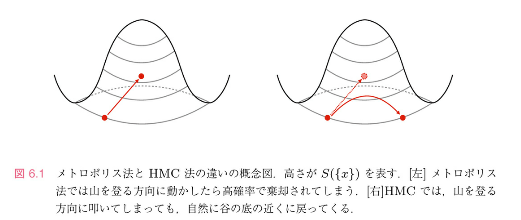

<!--
headingDivider: 1
-->

# 6.1.HMC法

この章ではHMC法(Hybrid Monte Calro法)について解説します。

積分に大きな寄与をするのは作用S(x)が小さな領域でした。

ここで、S(x)を標高とみなすと、

$$
重要な配位=谷底
$$
と思えます。

大雑把なイメージとしては、マルコフ連鎖モンテカルロ法というのはボールをランダムな方向へ向けてたたきながら転がしていくようなもので、山の上に向けてボールを転がそうとしてもほとんど動かせないので、ほとんどの時間は谷底付近を転がっていくようになる。

したがって、より効率よく積分をしたければ、山を登る方向にたたくことはできるだけ避けて、可能な限り谷底に沿って押していくようにすべきです。

---

このような言い方をすると三次元の地図を連想するかもしれないが、そのイメージが正しいのは変数が二つの時だけ。

多変数の場合には、

$$
$$

というたくさんの変数でラベルされた高次元空間の地図をイメージする必要があります。

このような高次元空間の地図では、谷底に沿って動くような方向というのは非常に限られていて、メトロポリス法のように完全にランダムにボールをたたくと、ほぼ100%の確率で急坂を登ろうとすることになってしまいます。（図6.1の左側）

---

そのため，ステップ幅を非常に小さく取らなければ更新確率が上がりませんし，ステップ幅を下げて更新確率を上げたところで，谷底に沿って動いてくれることはまずありません．結果として，自己相関がとても長くなってしまいます．

HMC法は、この問題を避けて効率的に谷底を動き回れるように工夫されたアルゴリズムです。

---

名前の由来は、メトロポリス法と分子動力学法という二つの異なる手法を組み合わせた「ハイブリッド」なモンテカルロ法（MC）だという意味です。

また、物理学におけるハミルトンの運動方程式とそれに現れるハミルトニアンという量の類似物を使うという意味で、

HMC法では配位 ${}$ を以下のようにして生成します。

まず、{}

# HMC法

1. $x_i^{(k)}$ の「共役運動量」 $p_i^{(k)}$ をガウス関数の重み $\frac{1}{\sqrt{2\pi}} e^{-\frac{(p_i^{(k)})^2}{2}}$ でランダムに生成する（ガウス乱数を生成するにはボックス・ミュラー法（2.4.1節）が便利です）。

2. 「初期時刻 $\tau = 0$ でのハミルトニアン」

$$
H_{\text{init}} = S(\{x^{(k)}\}) + \frac{1}{2} \sum_i (p_i^{(k)})^2
$$

を計算する（この「時刻」は実際の時間とは関係がない仮想的な「時刻」で、計算の便宜上導入しただけであることに注意してください）。

---

3. 分子軌道法：以下で説明する「リープフロッグ法」を用いて、$\tau$ に沿って「時間発展」をさせる。初期条件は

$$
x_i^{(k)}(\tau = 0) = x_i^{(k)},
$$

$$
p_i^{(k)}(\tau = 0) = p_i^{(k)}
$$

とし、終時刻 $\tau = \tau_{\text{fin}}$ での「終状態」 $x_i^{(k)}(\tau_{\text{fin}}), p_i^{(k)}(\tau_{\text{fin}})$ を計算する。

---

4. 「終状態でのハミルトニアン」

$$
H_{\text{fin}} = S(\{x^{(k)}(\tau_{\text{fin}})\}) + \frac{1}{2} \sum_i (p_i^{(k)}(\tau_{\text{fin}}))^2
$$

を計算する。

5. メトロポリステスト：0 と 1 の間の一様乱数 $r$ を生成し、

$$
r < e^{H_{\text{init}} - H_{\text{fin}}}
$$

なら $x_i^{(k)}(\tau_{\text{fin}})$ を新しい配位として採用 $(x_i^{(k+1)} = x_i^{(k)}(\tau_{\text{fin}}))$，それ以外は棄却 $(x_i^{(k+1)} = x_i^{(k)}(0))$。

# 6.1.1 物理の直観に基づく理解

HMC法の細かい解説の前に、このアルゴリズムの「心」を理解することから始める。

# 6.1.2.リープフロッグ法

離散化する前のハミルトン方程式は

$$
\frac{dp_i}{d\tau} = -\frac{\partial H}{\partial x_i} = -\frac{\partial S}{\partial x_i}, \quad \frac{dx_i}{d\tau} = \frac{\partial H}{\partial p_i} = p_i \tag{6.1}
$$

上記は、

$\tau$ ：時間

$S$ :ポテンシャルエネルギー

としたときの物理系の時間発展を司る運動方程式

HMCアルゴリズムを使いこなすために唯一必要なのはエネルギー保存則

＝Hの値が一定

# 証明

これは、無限小の時間発展

$$
\tau \rightarrow \tau + \delta \tau
$$

でのHの変化は

$$
\Delta H = \sum_i \left( \frac{\partial H}{\partial x_i} \Delta x_i + \frac{\partial H}{\partial p_i} \Delta p_i \right)
$$
$$
= \sum_i \left( \frac{\partial H}{\partial x_i} \frac{dx_i}{d\tau} \Delta \tau + \frac{\partial H}{\partial p_i} \frac{dp_i}{d\tau} \Delta \tau \right)
$$
$$
= \sum_i \left( \frac{\partial H}{\partial x_i} \frac{\partial H}{\partial p_i} \Delta \tau - \frac{\partial H}{\partial p_i} \frac{\partial H}{\partial x_i} \Delta \tau \right)
$$
$$
= 0 \tag{6.2}
$$

となる。

---

リープフロッグ法は、ハミルトン方程式に従う時間発展を以下のように離散化して得られます。

操作の順番と、最初と最後に出てくる1/2という因子に気を付ける。

これらは時間発展の可逆性と詳細つり合い条件が満たされるために非常に重要です。

# リープフロッグ法

1. 導入
$$
x_i(\Delta \tau / 2) = x_i(0) + p_i(0) \cdot \frac{\Delta \tau}{2}
$$

2. メイン：$n = 1, 2, \dots, N_{\tau} - 1$ について以下を繰り返す：
$$
p_i(n \Delta \tau) = p_i((n - 1) \Delta \tau) - \frac{\partial S}{\partial x_i}((n - 1/2) \Delta \tau) \cdot \Delta \tau
$$
$$
x_i((n + 1/2) \Delta \tau) = x_i((n - 1/2) \Delta \tau) + p_i(n \Delta \tau) \cdot \Delta \tau
$$

3. 終了
$$
p_i(N_{\tau} \Delta \tau) = p_i((N_{\tau} - 1) \Delta \tau) - \frac{\partial S}{\partial x_i}((N_{\tau} - 1/2) \Delta \tau) \cdot \Delta \tau
$$
$$
x_i(N_{\tau} \Delta \tau) = x_i((N_{\tau} - 1/2) \Delta \tau) + p_i(N_{\tau} \Delta \tau) \cdot \frac{\Delta \tau}{2}
$$
