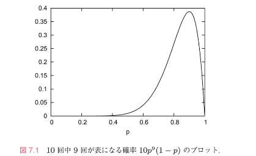

<!--
headingDivider: 1
-->

# 7.1 尤度とベイズ統計

この章ではMCMC法の統計学への応用例を紹介します。

# 7.1.1 「もっともらしさ」を定義する

MCMC法をベイズ統計に応用するとき、何を変数と思い、何をパラメーターと思うかで混乱しがち

まずは基礎を固める

例としてコイン投げを考える

通常、コイン投げをしたら「表と裏が同じ確率で現れる」とするのが「もっともらしい」仮定です。

しかし、実際に投げると10回投げたら９回表が出たとする

１０回のコイン投げでは合計

$$
2^{10} = 1024通り
$$

の結果があり裏が１回だけというのはこのうち１０通りだけなので裏と表の出る確率が半々だとしたら確率は１％ほどしかない

---

このコインを投げた時に表が出る確率pはどのくらいと推定できるでしょうか？

直観的にはp=9/10だと思うかもしれない

確かにこれは「もっともらしい」が、この直感は定量的にどの程度正しい？

このような疑問に答えるための論理的枠組みを構築する

表が出る確率をpとしているので、10回中9回が表になる確率は

$$
10p^9(1-p)
$$

です。

これをｐの関数としてプロットすると下の図7.1のようになる。

---

p=9/10で最大値(約0.39)を取ります

「表が出る確率は0.9」と結論するのはそれなりにもっともらしそう

一方、p=1/2だったとすると、この現象が実現する確率は約0.01なので、あまりもっともらしくない

ですが、実際にp=0.9と結論できるかというとそうでもない

p=0.8からp=0.95あたりであれば $10p^9(1-p)$ の値は十分に大きく、それなりのもっともらしさがある。

---

そこで、ここで計算した「仮に表が出る確率がpだったとしたとき、実際に「表が9回出る」という現象が起こる確率 $10p^9(1-p)$ 」を「もっともらしさ」を定量的に特徴づける指標として採用し、尤度（likelihood）と呼びます。

もっと一般的に、１０回中ｋ回が表になる確率は

$$
P(k|p) = \binom{10}{k} \cdot p^k (1 - p)^{10 - k} = \frac{10!}{k!(10 - k)!} \cdot p^k (1 - p)^{10 - k} \tag{7.2}
$$

です

表の出る確率がpであると仮定したことを強調するためにP(k|p)という記号を用いました。

このP(k|p)が、「１０回中回が表だった」という結果がすでにある時の尤度です。

尤度が最も大きくなるようなpの値が一番もっともらしいだろうと考えるのが最尤法です。

---

このように、尤度というのは、実際にある現象が起きた時に、その現象が起こる確率として定義されます。

普通の確率と違うのは、現象を特徴づけている量（今の場合なら「表が出る確率」p）を変数とみなす点です

「確率」と「尤度」は同じ関数ですが、その解釈が異なります

- 表の出る確率pが与えられていると思うと、P(k|p)は１０回中ｋ回表が出る「確率」
- 10回中k回が表だったという結果がすでに与えられており、そこから表の出る確率ｐを逆算したいと思うと、P(k|p)は表の出る確率がｐであるという推測のもっともらしさを表す「尤度」

---

同じ考え方は確率分布にも適用できます

例としてガウス分布

$$
\rho(x|\mu, \sigma) = \frac{e^{-\frac{1}{2} \frac{(x - \mu)^2}{\sigma^2}}}{\sqrt{2\pi \sigma^2}}
$$

を考える。

「μとσが指定されている」ことを強調してρ（ｘ｜μ,σ）とした

個のガウス分布に従ってn個の乱数を生成すると、 $x_1,x_2,...,x_n$ が得られる確率は
$$
P(x_1, \cdots, x_n | \mu, \sigma) = \rho(x_1 | \mu, \sigma) \times \rho(x_2 | \mu, \sigma) \times \cdots \times \rho(x_n | \mu, \sigma)
$$

$$
= \prod_{i=1}^{n} \rho(x_i | \mu, \sigma) \tag{7.4}
$$

---

「n回乱数を振ったら $x_1, \cdots, x_n$ が出た」という結果がすでにある時，$P(x_1, \cdots, x_n | \mu, \sigma)$ を $\mu$ と $\sigma$ の関数として見れば，$P(x_1, \cdots, x_n | \mu, \sigma)$ が大きいほどもっともらしいと思えるので，確率 $P(x_1, \cdots, x_n | \mu, \sigma)$ は尤度とも解釈できる

伝統的な統計学では，コインの場合の $p$ やガウス分布の場合の $\mu, \sigma$ は（仮にわからなかったとしても，原理的には）決まっているものと思い，その上で現象が起こる確率を評価する

$p$ の値を推測したければ最尤法などを用います。

7.1.3 節で説明するベイズ統計では、「ｐ確率分布」という概念を許容する

そして、尤度とベイズの定理を組み合わせてｐの確率分布を推測する

ここまでの議論は $P(k|p)$ や $P(x_1,...,x_n|\mu,\sigma)$ のように尤度の関数形が分かっている前提にしていますが、現実の場面では、ｋや ${x_i}$ のようなデータが与えられても、それがどんな尤度関数から生じたのはわからないことがほとんど

そのような場合、「もっともらしい関数形」を自分で見つける必要がある

これから説明するやり方はガウス分布以外の尤度関数にも応用できるので、いろいろな関数形を仮定して尤度を計算し、ある程度大きな尤度が得られることを「もっともらしさ」の基準の一つとするのが自然な戦略

# 最小二乗法との関係

# 7.1.2 尤度の計算　~ガウス分布を例に 

それでは、ガウス分布の場合について、マルコフ連鎖モンテカルロ法を使って尤度を計算してみる

# 一変数の場合

乱数の組 ${x_i}$ が与えられたとする

この乱数がガウス分布ρ（ｘ｜μ,σ）から得られたものであると分かっているけれども分布のパラメータである平均値μと分散σは知らないものとする

この場合に与えられた乱数の組 ${x_i}$ から逆にμとσを推定しようというのが今の問題の趣旨です

---

平均μ、分散σのガウス分布からこのｎ個の乱数が生じる確率は

$$
\rho(x|\mu, \sigma) = \frac{e^{-\frac{1}{2} \frac{(x - \mu)^2}{\sigma^2}}}{\sqrt{2\pi \sigma^2}}
$$

と

$$
P(x_1, \cdots, x_n | \mu, \sigma) = \rho(x_1 | \mu, \sigma) \times \rho(x_2 | \mu, \sigma) \times \cdots \times \rho(x_n | \mu, \sigma)
$$

$$
= \prod_{i=1}^{n} \rho(x_i | \mu, \sigma) \tag{7.4}
$$

で与えられます。

---

これを $\mu$ と $\sigma$ の関数と考えて「$\{x_i\}$ が実現されるもっともらしさ」と解釈するのが尤度です。

マルコフ連鎖モンテカルロ法を使うために，$P(x_1, \cdots, x_n | \mu, \sigma) \propto e^{-S(x_1, \cdots, x_n | \mu, \sigma)}$ によって作用関数 $S(x | \mu, \sigma)$ を定義します。

---

今の例なら，

$$
S(x_1, \cdots, x_n | \mu, \sigma) = \sum_{i=1}^{n} \frac{(x_i - \mu)^2}{2\sigma^2} + n \log \sigma
$$

$$
= \frac{n}{2\sigma^2} \mu^2 - \frac{\sum_{i=1}^{n} x_i}{\sigma^2} \mu + \frac{\sum_{i=1}^{n} x_i^2}{2\sigma^2} + n \log \sigma
$$

$$
= n \left( \frac{1}{2\sigma^2} (\mu - \bar{x})^2 + \frac{1}{2\sigma^2} (\bar{x^2} - \bar{x}^2) + \log \sigma \right) \tag{7.9}
$$

です。ただし，$\bar{x} \equiv \frac{1}{n} \sum_{i=1}^{n} x_i$, $\bar{x^2} \equiv \frac{1}{n} \sum_{i=1}^{n} x_i^2$ はそれぞれ $x_i$ と $x_i^2$ の平均値です。$n \log \sigma$ は規格化因子 $(2\pi \sigma^2)^{-n/2}$ に起因します。

# 多変数の場合

# 7.1.4 ベイズの定理

# 7.1.5 MCMC法によるベイズ更新の例

$$
P(p|k) = \frac{P(k|p) \cdot P(p)}{P(k)} \tag{7.23}
$$

や

# 