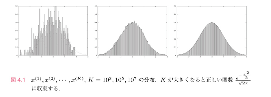
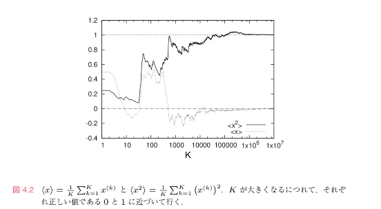

# メトロポリス法

前章ではマルコフ連鎖モンテカルロ法の一般論を説明した。

この章では、マルコフ連鎖モンテカルロ法のサンプリング方法であるメトロポリス法を導入する。

ギブスサンプリングとメトロポリス法のどちらもMCMC法のサンプリング方法であるが、適した場面が異なる。

一般的に言われているのが、ギブスサンプリングは条件付き確率が求めやすい形のとき、メトロポリス法は条件付き確率が求めにくい形のときに用いられるということ。

てことはメトロポリス法の方が汎用性があり、ずっと使い続ければ良いんじゃと思うかもしれないが、メトロポリス法の方がパラメータ調整が難しい（後述）。

本章では一番簡単な一変数積分を説明する。

## 4.1 メトロポリス法

確率P(x)を、

$$
P(x) = \frac{e^{-S(x)}}{Z} \tag{4.1}
$$

とする。

S：物理学では作用、統計では対数尤度（符号が逆のことを除いて）

S(X)：実変数xの連続関数

規格化因子Z ：分配関数

> 𝜇（ミュー、平均）= 0

> 𝜎（シグマ、標準偏差） = 1

のガウス関数

$$
\frac{1}{\sqrt{2\pi}} e^{-\frac{x^2}{2}}
$$

の場合には、　

$$
S(x) = \frac{x^2}{2}
$$

$$
Z = \sqrt{2\pi}
$$

実際の場合には、S（X）だけ知っていて、Zはわからない場合がほとんど。

メトロポリス法では、初期値 $x^{(0)}$ から次のような手順で $x^{(0)},x^{(1)}...x^{(k)},x^{(k+1)}$ を構成します：

メトロポリス法

(1) -cと+c（適当なc > 0）間から、実数 $\delta x$ を一様乱数として選び、 $x'=x^{(k)} + \delta x$ を $x^{(k+1)}$ の候補として提案する。ただし、詳細つり合い条件を満たすために $\delta x$ と $^- \delta x$ が同じ確率で現れる。

(2) メトロポリステスト：０と１の間の一様乱数を生成し、$ r < e^{S(x^{(k)}) - S(x')}$ なら提案を受理して $x^{(k+1)} = x'$ と更新する。さもなくば、提案を棄却して  $x^{(k+1)} = x^{(k)}$ とする。すなわち、

※ $\delta x$ は各kごとにランダムに選ぶ

また、二つ目のステップは確率

$$
min(1,e^{S(x^{(k)})-S(x')})
$$

理由

もし、

$$
e^{S(x^{(k)}) - S(x')} = 0.5
$$

ならば、0から1の間の一様乱数rが $e^{S(x^{(k)}) - S(x')}$ より小さくなる確率は0.5となる、確率 $e^{S(x^{(k)}) - S(x')} = 0.5$ で提案を受理する。

もし、
$$
e^{S(x^{(k)}) - S(x')} = 0.3
$$

なら、上記と同様に確率0.3で提案を受理する。

しかし、

$$
e^{S(x^{(k)}) - S(x')} = 1.5
$$

であれば、rは必ず $e^{S(x^{(k)}) - S(x')}$ より小さくなるので、必ず提案は受理されます。

したがって、提案が受理される確率は、

$$
min(1,e^{S(x^{(k)})-S(x')})
$$

です。

上記のメトロポリス法は詳細つり合い条件に以外の3条件が満たされていることは簡単にわかる：

（１） $\delta x$ は-cからcの間の一様乱数であり、確率 $min(1,e^{S(x^{(k)})-S(x')})$ で $x^{(k+1)} = x^{(k)} + \delta x$ となり、確率 $1 -min(1,e^{S(x^{(k)})-S(x')})$ で $x^{(k+1)} = x^{(k)}$ と更新するので、 $x^{(k+1)}$ は $x^{(k)}$ にのみ依存する。よってマルコフ連鎖。

（２）連続な定義域を考えているのであらゆる異なる変数の組x、x'は有限会のステップで移りあえるのは明らか。

（３）任意の $n_s＝1, 2, ･･･$ に対し，ステップ数 $n_s$ で x から x 自身に戻って来られます（ $n_s＝1$ も，$\delta x ＝ 0$ とすれば可能です．S(x) の極大点以外では，メトロポリステストで棄却されて $n_s＝1$ が実現されることもあり得ます）。したがって周期は１です．

（４）詳細釣り合い条件も成り立っているのですが，これは少し非自明なので，スキップする。

## 4.2.期待値計算の具体例

引き続き、

$$
S(x) = \frac{x^2}{2}
$$

とする。

マルコフ連鎖モンテカルロ法を用いたあらゆるプログラムは基本的に同じ形をしています。

問題の特徴に合わせてメトロポリス法よりも効率的な洗練されたアルゴリズムが用いられますが、どれも基本的には $x→x'+\delta x$ のステップを改良しているだけです。

このプログラムが理解できれば、あとは技術的な詳細を除いてすべて同じだと思ってよい。

具体的なシミュレーション結果を見てみる。

初期条件は $x^{(0)} = 0$ とし、ステップ幅を0.5としてみます。（後で説明するが、実はこのステップ幅はあまり効率的ではない）。

図4.1に、

$$
x^{(1)},x^{(2)},...,x^{(K)}
$$

の分布を $K=10^3,10^5,10^7$ について示しました。

Kが大きくなるにしたがって、正しい分布

$$
\frac{e^{-\frac{x^2}{2}}}{\sqrt{2\pi}}
$$

に収束していくことがはっきりと見て取れます。

### ・間違いの例

## 4.3.自己相関

## 4.5.複雑な数値積分への応用

マルコフ連鎖モンテカルロ法では、分配関数Zは直接計算できません。

期待値が計算できるだけです。

多くの場合、分配関数は単なる規格化因子なので特に必要ではありません。

しかし、Ｚの値自体に興味がある場合もあります。

その場合、どのようにしてＺの値を計算するのか？

一変数の場合であれば、ｘの確率分布

$$
P(x) = \frac{e^{-S(x)}}{Z}
$$

をプロットして

$$
\frac{e^{-S(x)}}{Z}
$$

との比を見るだけでよいですが、このやり方は多変数の場合には通用しません。

以下、多変数の場合に簡単に一般化できる手法を紹介する。
